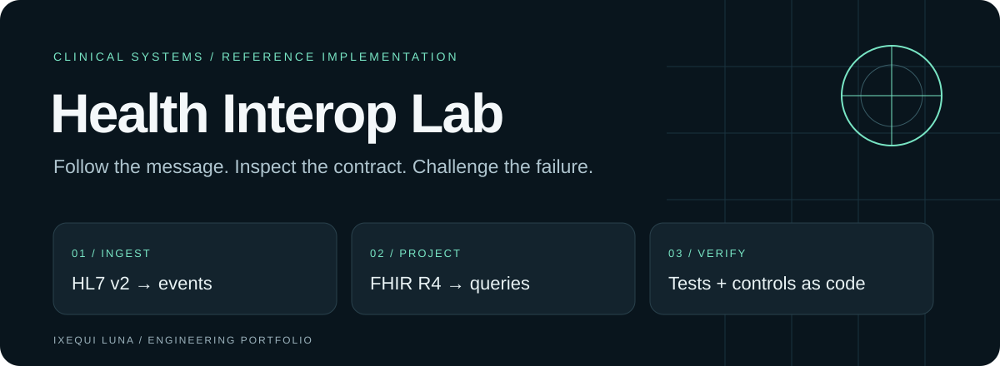
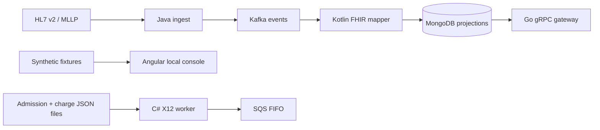

# Health Interop Lab

**Clinical messages cross systems. Their meaning should survive the trip.**

A polyglot engineering lab for exploring HL7 ingestion, FHIR projections, patient queries and X12 claim generation. Built around the hard parts: acknowledgement timing, stale events, malformed envelopes and predictable failure handling.

[Start locally](#start-with-the-console) · [Architecture](docs/ARCHITECTURE.md) · [Engineering tour](docs/ENGINEERING-TOUR.md) · [Español](README.es.md) · [Ixequi Luna](https://ixequiluna.ai)

[](https://github.com/ixequiluna-source/health-interop-lab/actions/workflows/hl7-ingest-java.yml)
[](https://github.com/ixequiluna-source/health-interop-lab/actions/workflows/fhir-mapper-kotlin.yml)
[](https://github.com/ixequiluna-source/health-interop-lab/actions/workflows/patient-gateway-go.yml)
[](https://github.com/ixequiluna-source/health-interop-lab/actions/workflows/claims-edi-dotnet.yml)
[](https://github.com/ixequiluna-source/health-interop-lab/actions/workflows/console-angular.yml)
[](https://github.com/ixequiluna-source/health-interop-lab/actions/workflows/policy.yml)

## Explore three engineering problems

| Problem | Implementation to inspect | Why it is interesting |
| --- | --- | --- |
| A message looks valid, but its acknowledgement is wrong | [Java ingest](services/hl7-ingest-java) | ER7 parsing, MLLP framing and AA/AE/AR acknowledgement behavior. |
| An older event arrives after a newer one | [Kotlin mapper](services/fhir-mapper-kotlin) | FHIR Patient/Encounter mapping, projection ordering and dead-letter handling. |
| A plausible claim has an invalid envelope | [C# claims](services/claims-edi-dotnet) | Fixed-width ISA, control-number linkage, segment counts and parser/writer round trips. |

The [Go gateway](services/patient-gateway-go) adds read-only gRPC queries and deterministic pagination. The [Angular console](web/console-angular) explores patient search, detail views and pipeline status using synthetic local data.

## Start with the console

The fastest way to explore the interface needs Node.js 22 and npm, not a cloud account:

```sh
git clone https://github.com/ixequiluna-source/health-interop-lab.git
cd health-interop-lab/web/console-angular
npm ci
npm start
```

Open **http://localhost:4200**. The development configuration uses an in-memory gateway with synthetic patients. Try a patient search, open a record, move between results and inspect the pipeline view. Its status values are fixtures, not live operational telemetry.

```sh
# In web/console-angular
npm test -- --watch=false
npm run build
```

The production build selects the HTTP gateway and requires a compatible server-side adapter; it is not the same self-contained demo. See [architecture and integration boundaries](docs/ARCHITECTURE.md).

## Read the system in layers



Solid paths describe implemented component interfaces; this diagram is not proof of a deployed end-to-end environment. The console-to-gRPC adapter and upstream assembly of claim files remain integration work.

## Evidence over adjectives

Each language has a [dedicated workflow](.github/workflows). Badges link to its latest execution; path-filtered workflows can refer to different commits. A green service build does not prove the whole distributed pipeline works together.

The [policy suite](tools/policy/test_policies.py) checks infrastructure declarations without cloud credentials:

```sh
# From the repository root, in a Python virtual environment
python -m pip install pytest pyyaml
python -m pytest tools/policy/test_policies.py -v
```

[Review notes and verification scope](docs/REVIEW-2026-09-19.md) distinguish local checks, existing CI evidence and outstanding integration work.

## Boundaries

This is a reference lab using synthetic data, not a clinical deployment or a certified product. The [control matrix](compliance/soc2/control-matrix.md) maps technical checks to control objectives; it is not a SOC 2 attestation or a declaration of HIPAA compliance. FIFO deduplication is one delivery control, not a guarantee against duplicate billing across an entire system.

Infrastructure files are reviewable examples. Cloud provisioning, real patient data and production operation require separate validation and operational controls.

## Author

Maintained by **[Dr. Ixequi Luna](https://ixequiluna.ai)**. Explore the implementation, inspect the tests, or [open an issue](https://github.com/ixequiluna-source/health-interop-lab/issues) with a reproducible failure and synthetic input.
